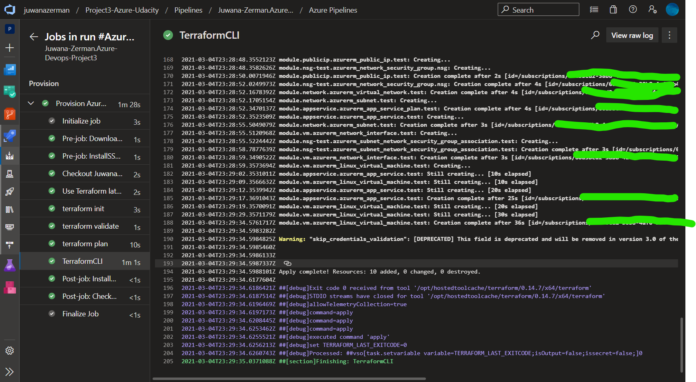
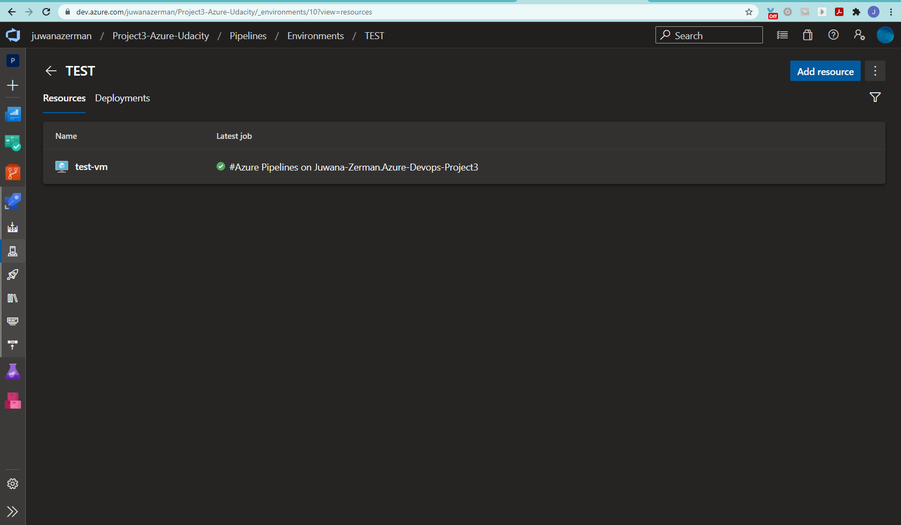
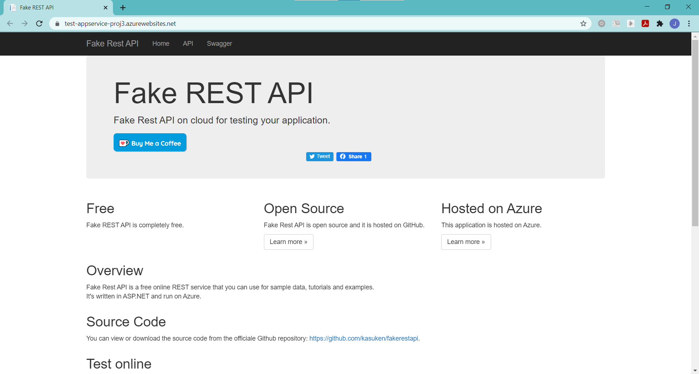
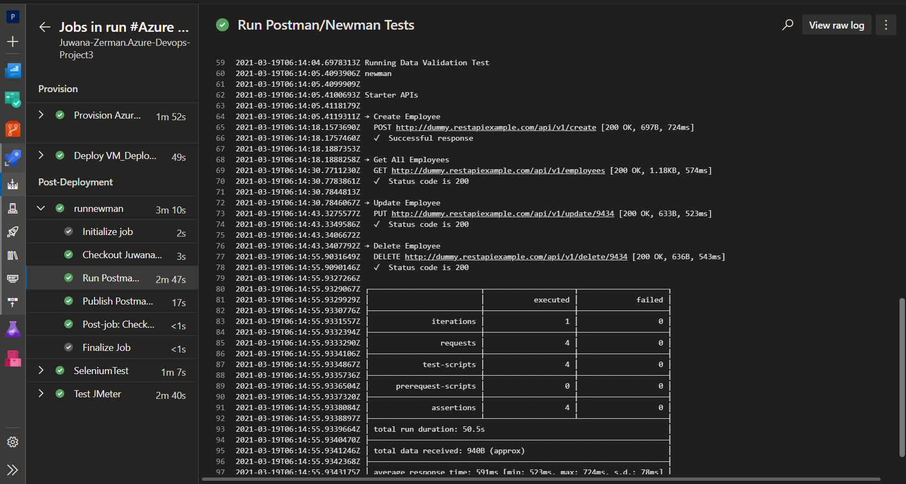
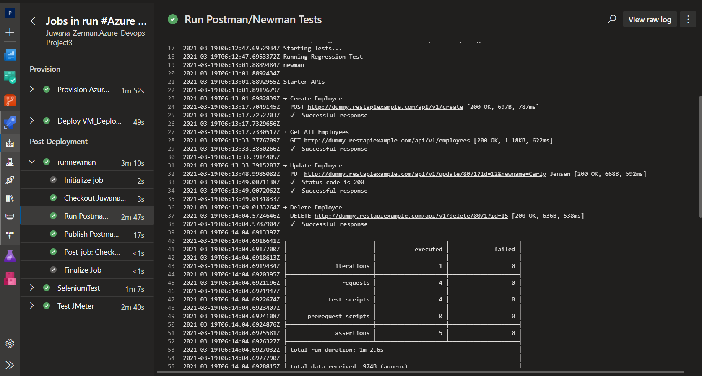
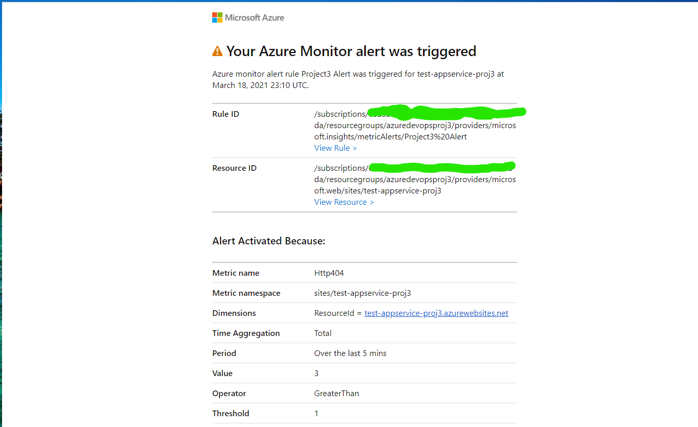

[](https://dev.azure.com/juwanazerman/Project3-Azure-Udacity/_build/latest?definitionId=9&branchName=main)

# Azure-Devops-Project3: Ensuring Quality Releases

### Visit App Service Website (Until Resources Removed) [Click Here!](https://test-appservice-proj3.azurewebsites.net)

## Project Overview

In this project, I will demonstrate the skills learned about ensuring quality releases in the Udacity Nanodegree: DevOps Engineer for Microsoft Azure. Using Microsoft Azure, I will create a VM using Terraform and deploy an app to Azure AppService. I will then test environments and run automated tests. I will also utilize monitoring tools to provide insight into my application's behavior by querying custom log files.

### Dependencies

* Python
* Terraform
* JMeter
* Postman
* Selenium
* Azure DevOps
* Azure CLI
* Azure Log Analytics

### Project Steps

#### Installation & Configuration

Configure the storage account and state backend. Replace the values below in terraform/environments/test/main.tf files with the output from the Azure CLI:

    * storage_account_name
    * container_name
    * key
    * access_key
[Click Here](https://docs.microsoft.com/en-us/azure/developer/terraform/store-state-in-azure-storage) for instructions on creating the Azure storage account and backend. You may also use the commands in the ```bashstoragescript.sh``` file in the repo to this.

Create a Service Principal for Terraform and replace the below values in the terraform/environments/test/terraform.tfvars files with the output from the Azure CLI.

    * subscription_id
    * client_id
    * client_secret
    * tenant_id

Login to Azure:<br>
**`az login`**

Create the password based authentication service principal for your project and query it for your ID and SECRET data: <br>
    **`az ad sp create-for-rbac --name SPProject3 --query "{client_id: appId, client_secret: password, tenant_id: tenant}"`**<br>
Make note of the password because it can't be retrieved, only reset.

Login to the Service Principal using the following command with you credentials from the previous step: <br>
    **`az login --service-principal --username APP_ID --tenant TENANT_ID --password CLIENT_SECRET`**

[Click Here](https://registry.terraform.io/providers/hashicorp/azurerm/latest/docs/guides/service_principal_client_secret) if you need help with the steps for creating a service principal.
#### Azure DevOps

1. Create a new Azure Pipeline from the **`azure-pipelines.yaml`** file or start building one from scratch if you prefer.

2. Create a new service connection: In Azure Devops go to Project Settings > Service Connections > New Service Connection > Azure Resource Manager > Next > Service Principal (Automatic) > Next > Subscription. After choosing your subscription provide a name for the service connection.

3. If the pipeline runs now it will fail since no resources are provisioned yet in Azure.

4. Create an SSH key to log in to your VM. [Click Here](https://docs.microsoft.com/en-us/azure/virtual-machines/linux/mac-create-ssh-keys) for instructions on setting up an SSH key.

5. This SSH key can be saved and added to Azure Pipelines as a secure file. I also loaded my terraform.tfvars to Azure Pipelines as a secure file along with a .env file with my access-key.

6. Create your Azure resources (Most can be provisioned via Terraform using the Pipeline by adding tasks and jobs to the `azure-pipelines.yml` file utilizing ```terraform init```, ```terraform plan```, and ```terraform apply``` commands).



7. Once the resources are deployed you will have to follow the instructions on setting up an environment in Azure Pipelines to register the Linux VM so your app can be deployed to it. You can find that documentation [here](https://docs.microsoft.com/en-us/azure/devops/pipelines/process/environments-virtual-machines?view=azure-devops). In Azure DevOps under Pipelines > Environments > TEST > Add resource > Select "Virtual Machines" > Next > Under Operating System select "Linux".  You will be given a registration script to copy. SSH into your VM and paste this script into the terminal and run it. This will register your VM and allow Azure Pipelines to act as an agent to run commands on it.



8. Build the FakeRestAPI and Automated Testing artifacts and publish them to the artifact staging directory in the Pipeline.

9. Deploy the FakeRestAPI to your App Service on your VM. The URL for my webapp is https://test-appservice-proj3.azurewebsites.net/. It should look like the image below.



## Running Tests in Pipeline

#### Postman

[Install Postman](https://www.postman.com/downloads/). With the starter files I was able to test the dummy API locally with different environment variables and then export the results as a collection to my project directory. Once the collection files have been pushed to GitHub you will need to create a script to run a Data Validation and Regression test in the Pipeline and create a report of the results. The command line Collection Runner [Newman](https://learning.postman.com/docs/running-collections/using-newman-cli/command-line-integration-with-newman/#:~:text=Newman%20is%20a%20command%20line,integration%20servers%20and%20build%20systems.) was used to perform these tests. The following script was used:

```
    sudo npm install -g newman reporter
    echo 'Starting Tests...'
    echo 'Running Regression Test'
    newman run automatedtesting/postman/RegressionTest.postman_collection.json  --delay-request 15000 --reporters cli,junit --suppress-exit-code /
    echo 'Running Data Validation Test'
    newman run automatedtesting/postman/DataValidation.postman_collection.json  --delay-request 12000 --reporters cli,junit --suppress-exit-code
```

Be sure to publish the results of this script in JUnit format to an xml file to view the results. The results of the tests will also appear in the Pipeline output like so:





**Note**: The dummy API provided in the starter code is buggy. While the tests pass locally, in the Pipeline most times a `429` error is present indicating `too many requests `have been made.

#### Selenium

The project requires that Selenium is installed on the VM to test the UI functionality of `https://www.saucedemo.com/` website. The test suite should show which user logged in, what items were added to the shopping cart, and what items were removed from the shopping cart. I created the python code locally and made sure the test was working before ingesting it into the Pipeline. To this:

1. [Download the latest Chrome driver](https://sites.google.com/a/chromium.org/chromedriver/). Make sure chromedriver is added to PATH.
2. Run
        **`pip install -U selenium`**
3. You can test Selenium by executing the **`login.py`** file in the Selenium folder. It should open the site and add all items to the shopping cart and then remove them from the shopping cart.
4. A script will need to be created to perform these tasks in the CLI in the Azure Pipelines  at this point. Make sure the script includes logging the items being added and removed from the cart that can be sent to an output file.

#### JMeter

1. [Install JMeter](https://jmeter.apache.org/download_jmeter.cgi).
2. Replace the APPSERVICEURL with the Url of your AppService once it's deployed.

#### Setup Log Analytics
A Log Analytics Workspace will need to be created to ingest the Selenium Log output file.

Go to the app service > Diagnostic Settings > + Add Diagnostic Setting. Click AppServiceHTTPLogs and Send to Log Analytics Workspace. Select a workspace (can be an existing default workspace) > Save. Go back to the app service > App Service Logs. Turn on Detailed Error Messages and Failed Request Tracing > Save. Restart the app service.

Return to the Log Analytics Workspace > Logs and run a query such as `Perf`to see some log results and check that Log Analytics is working properly.

#### Setup Custom Logging
In Log Analytics Workspace go to Advanced Settings > Data > Custom Logs > Add + > Choose File. Select the seleniumlog.txt file created from the Pipeline run. (I downloaded a copy to my local machine and uploaded a copy to the Azure VM) > Next > Next. Enter the paths for the Linux machine where the file is located, such as:
*    ` /seleniumlog.txt`
*   ` <your path>/seleniumlog.txt`

Give it a name and click Done. Make sure the box is checked to apply to my Linux Machines.

Return to the Log Analytics Workspace > Virtual Machines. Click on your VM, then Connect. An agent will be installed on the VM that allows Azure to collect the logs from it. (Under Settings > Agents you should see you have "1 Linux Computer Connected")

Return to the Log Analytics Workspace > logs. Under Queries you can enter the name of the custom log created in the previous query and click Run. It's possible this could take a while to show logs. The logs may only show if the timestamp on the log file is updated after the agent was installed. You may also need to reboot the VM.

#### Setup Email Alerts
The project also calls for creating an alert rule with an HTTP 404 condition. It also requires an action group to be created with Email notification. After the alert takes effect, visit the URL of the AppService and try to cause 404 errors by visiting non-existent pages. After the 2nd 404 error an email alert should be triggered. To set this up:

In Azure Portal go to the AppService > Alerts > New Alert Rule. Add the HTTP 404 condition with a threshold value of 1. This creates an alert once there are at least 2 404 errors. Click **Done**. Now create the action group with the notification type set to **Email/SMS message/Push/Voice** choosing the email option. Give it a name and severity level.

